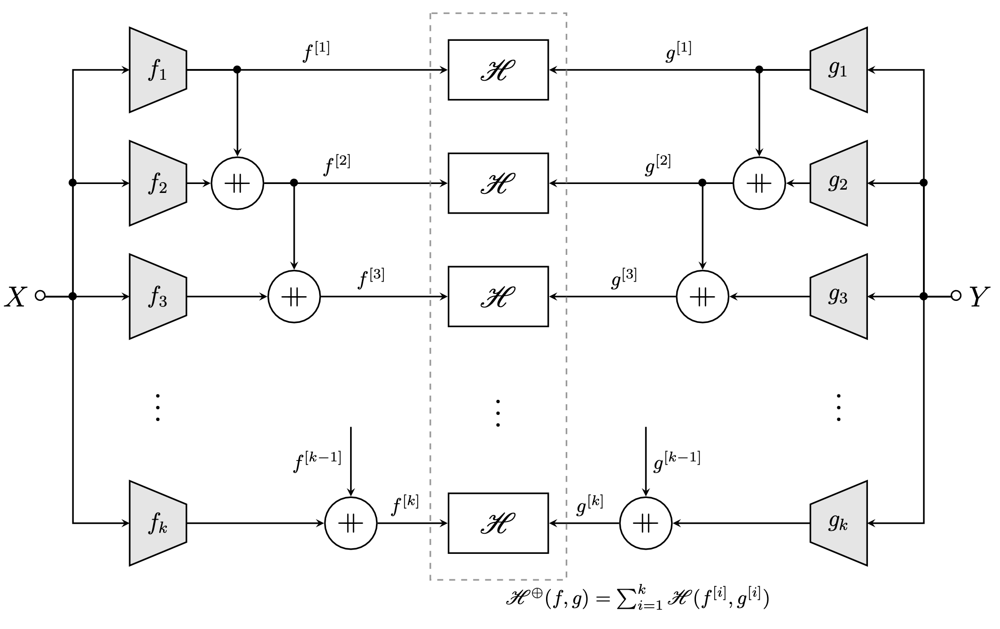

# Nested H-score: Computing Maximal Correlation Functions with Deep Learning

This short script illustrates how to extract maximal correlation functions with deep learning. The key is to optimize a cost function, called **nested H-score**, a variant of the H-score introduced in [1][2][3].

## Maximal Correlation Functions ##
For given variables $X$, $Y$, the maximal correlation functions $(f_1^\ast(x), g_1^\ast(y)), \dots, (f_k^\ast(x), g_k^\ast(y)), \dots$ represent the maximal correlated aspects of $X$ and $Y$, which can be recursively defined as [4]

$$
f^\ast_i, g_i^\ast = \mathop{\arg \max}_{f_i, g_i} \ \mathbb{E}[f_i(X) g_i(Y)].
$$

where the maximization is over all $f_i, g_i$'s satisfying the orthongality constraints

$$
 \mathbb{E}[f_i(X)f_j^\ast(X)] = \mathbb{E}[g_i(Y)g_j^\ast(Y)] = \delta_{ij}, \quad\text{for all } 0 \leq j \leq i,
$$

and where $f_0^\ast = g_0^\ast \equiv 1$ are constant functions.

## H-score ##

Given $k$-dimensional features $f$ of $X$ and $g$ of $Y$, the H-score $\mathscr{H}(f, g)$ is defined as

$$
   \mathscr{H}(f, g) = \mathbb{E}[\langle f(X),  g(Y)\rangle] - \langle \mathbb{E}[f(X)],  \mathbb{E}[g(Y)]\rangle - \frac 12 \cdot \mathrm{tr}\left(\mathbb{E}[f(X)f^{\mathrm{T}}(X)]\cdot \mathbb{E}[g(Y)g^{\mathrm{T}}(Y)]\right).
$$

It can be verified that [1] to maximize $\mathscr{H}(f, g)$, the $k$-dimensional subspaces spanned by $f$ and $g$ should match the $k$-dimensional subspaces spanned by the top-$k$ maximal correlation functions $(f_1^\ast, \dots, f_k^\ast)$ and $(g_1^\ast, \dots, g_k^\ast)$, respectively.

## Nested H-score ##

The nested H-score is the sum of H-scores associated with a series of nested features, defined as
 
 $$
    \mathscr{H}^{\perp}(f, g) = \sum_{i = 1}^k \mathscr{H}(f_{[i]}, g_{[i]}),
 $$
 
 where $f_{[i]} = [f_1, \dots, f_i]^\mathrm{T}$  is the feature composed of the first $i$-dimensions of $f$.

Then, it can be verified that to maximize the nested H-score $\mathscr{H}^{\perp}(f, g)$, the one-dimension features $f_i$ and $g_i$  must be aligned to the $i$-th maximal correlation functions $f_i^\ast$, $g_i^\ast$, respectively.

More precisely, the functions $f = (f_1, \dots, f_k), g = (g_1, \dots, g_k)$ that maximize the nested H-score $\mathscr{H}^{\perp}(f, g)$ would satisfy

 $$
  f_i = a_i \cdot f_i^\ast, \quad g_i = b_i \cdot g_i^\ast,
 $$
 
 where $a_i, b_i$ are scalars with $a_i \cdot b_i = \mathbb{E}[f_i^\ast(X) g_i^\ast(Y)].$

With "$\mathbin{+\mkern-10mu+}$" denoting the feature concatenation operation, we can compute nested H-score $\mathscr{H}^{\perp}(f, g)$ with the following nested structure.

---

## References ##

[1] Wang, Lichen, Jiaxiang Wu, Shao-Lun Huang, Lizhong Zheng, Xiangxiang Xu, Lin Zhang, and Junzhou Huang. "[An efficient approach to informative feature extraction from multimodal data](https://ojs.aaai.org/index.php/AAAI/article/view/4464)." In Proceedings of the AAAI Conference on Artificial Intelligence, vol. 33, no. 01, pp. 5281-5288. 2019.

[2] Xu, Xiangxiang, and Shao-Lun Huang. "[Maximal correlation regression](https://ieeexplore.ieee.org/abstract/document/8979352)." IEEE Access 8 (2020): 26591-26601.

[3] Xu, Xiangxiang, Shao-Lun Huang, Lizhong Zheng, and Gregory W. Wornell. 2022. "[An Information Theoretic Interpretation to Deep Neural Networks](https://www.mdpi.com/1099-4300/24/1/135)" Entropy 24, no. 1: 135.

[4] Huang, Shao-Lun, Anuran Makur, Gregory W. Wornell, and Lizhong Zheng. "[On universal features for high-dimensional learning and inference](https://arxiv.org/pdf/1911.09105.pdf)." arXiv preprint arXiv:1911.09105 (2019).

